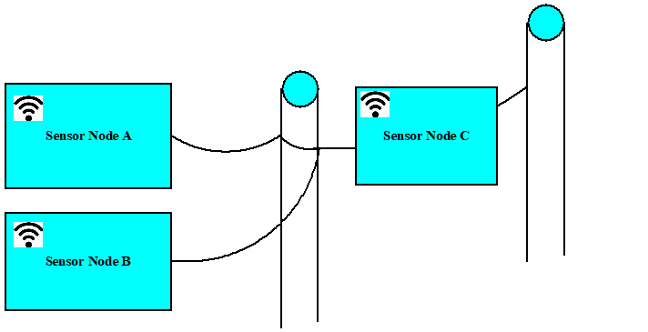
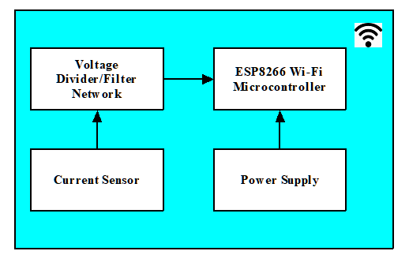

# Electricity Theft Project

	This project aims to determine the theft of electricity by customers

## Function/Purpose

We want to know at what point electricity is been stolen by using Kirchoff's current law to measure current at different nodes in the electricity network.

The following diagrams explains our approach. 

See the proposal [document]("Report/Proposal/Proposal Document.docx") for more information.

## Development Tools and Programming Languages Used

* Protues ISIS and ARES
* Sublime Text 3
* Languages include: 
* JavaScript
* Html5
* CSS3
* Python

## Deliverables:

In the end, the follwoings were delivered:
* Three hardware devices that measure AC load current in the range of 100A
* A web app that is be accessible on any browser.

## Hosting

The project is hosted online. See it [here](https://electricity-theft.herokuapp.com/)
